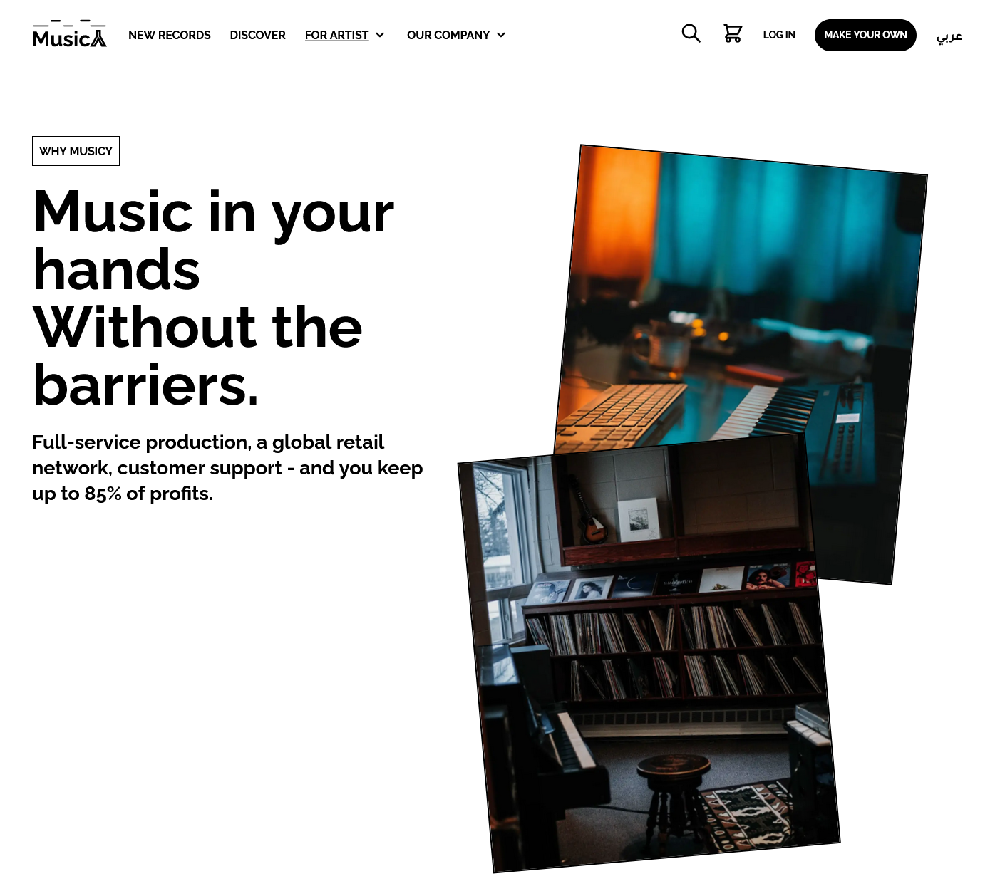

# MusicY why page || Frontend Practice

This is a solution for one of the projects in [Frontend Practice](https://www.frontendpractice.com/) by recreating a **real website** from **real company**.

## Table of contents

- Overview
  - Features
  - Screenshot
  - Links
  - Setup
- My process
  - Built with
  - Useful resources
- Author

## Overview

### Features

Users should be able to:

- View the optimal layout for the site depending on their device's screen size
- Site will use the Arabic language if the user system is an Arabic and user can change the language any time.
- Using <picture> tag to include the picture in multiple formats depending on the browser to optimize and minimize pictures size.
- Animation appears depending on the viewport.

### Screenshot



### Links

- Live Site URL: [Here](https://musicy.vercel.app/)
- GitHub URL: [Here](https://github.com/mohanadoo/musicy)

### Setup

Using yarn 👇

```
$ yarn
$ yarn dev
```

Using NPM👇

```
$ npm install
$ npm run dev
```

## My process

### Built with

- [React](https://reactjs.org/) - JS library
- [Tailwind CSS](https://tailwindcss.com/) - CSS framework
- [Headless UI](https://headlessui.dev/) - UI library
- [Framer Motion](https://www.framer.com/motion/) - Animation Library for React
- [i18next](https://www.i18next.com/) - i18next is an **internationalization-framework** written in and for JavaScript.
- [React Icons](https://react-icons.github.io/react-icons/) - React icons provides a huge collections of icons from different sources.

## Author

- Website - [Mohanad Portfolio](https://portfolio-mohanadoo.vercel.app/)
- Twitter - [@MohanadOO\_](https://twitter.com/MohanadOO_)
